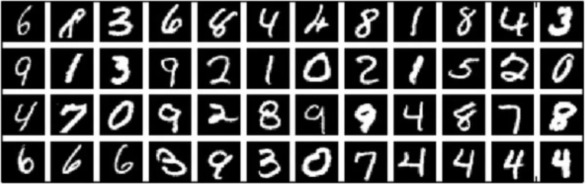

MNIST_deep_learning
---

As part of Udacity's AWS Machine Learning Nanodegree, part of the course was to design and build a fully connected 
neural network for classification of digits from the MNIST dataset.

## model_training

I modularised the code into sensible functions in order to train and test the model

- `get_train_test_data` : gets the data from the `torchvision.datasets` and loads it into a `torch.utils.data.DataLoader` object
- `create_model` : creates a sequential nn model with three hidden layers. `ReLU` and `LogSoftmax` are implemented as activation functions
- `train` : trains model
- `test` : tests model

- `train_test_model` : is the main script that implements the above functionality. 
  - The model was trained using a negative log likelihood loss function
  - Adam optimizer was used for learning
  - 20 Epochs of training were implemented
  - The model saved locally for later inference.
  - Performance here [GET PLOTS]

## model_inference

Half the fun of building models is to actually use them. I thought a fun way to perform inference will be through a 
draw pad on streamlit where we can get model inferences for novel digit inputs from users. 

